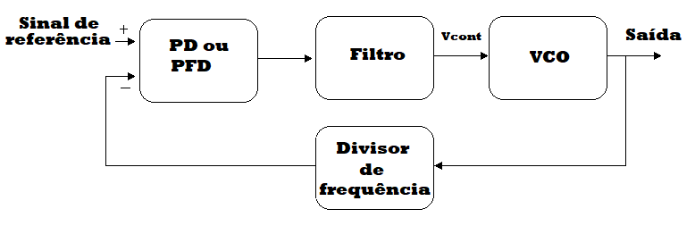

# PLL_Radiofrequency
## Tarefa desenvolvida para a disciplina de Circuitos de Radiofrequência, do curso de Engenharia Elétrica, UFERSA, Caraúbas, Brasil.
## Docente: Prof. Dr. Francisco de Assis Brito Filho
## Discentes: Jakson dos Santos Silva, José Ailton de Oliveira Júnior, Yago Daniel Souto
## Resumo
Este repositório apresenta a implementação e o tesbench de um circuito PLL (Phase Locked Loop) com o uso do software ADS (Advanced Design System) para sua caracterização, utilizando-se componentes comportamental e SMD comerciais. Com isso, os resultados de simulação para a tensão de controle do VCO (Oscilador Controlado por Tensão), a fase do VCO e a frequência do sinal de saída do VCO, serão desenvolvidos e comparados.
## Introdução
O Phase Locked Loop (PLL) é conhecido como Malha de Travamento de Fase, que no qual, faz parte de tecnologias referentes a transmissões sem fio, rádio e telecomunicações. O PLL é utilizado para demodulação FM, regeneração de sinais e sincronismos em transmissões digitais. Além disto, o PLL consisti em um sistema realimentado negativamente, que pode ser implementado de forma digital ou analógica, em que, para os digitais se trabalha em tempo discreto, utiliza-se filtros digitais e possuem detector de fase/frequência (PFD). Já os Analógicos são compostos geralmente por detector de fase (PD), filtro de malha e Osciladores Controlados por Tensão (VCO) que geram sinais senoidais. Contudo, os PLLs podem apresentar blocos mistos, digitais e analógicos, em que a principal razão para que eles possam ser classificados como digital ou analógico está na taxa de amostragem do sistema em relação a largura de banda (GUIMARÂES, 2015).  
Dessa forma, o princípio básico de funcionamento de um PLL está no ajuste contínuo da diferença entre as fases e/ou frequências presentes na entrada do loop. Na Figura 1 é visto um sistema básico de um PLL, em que esse sistema é composto por um detector de fase (PD) ou de fase/frequência (PFD), filtro de malha, VCO e um divisor de frequência. O PD ou PFD fornece uma tensão de controle que é proporcional a diferença de fase/frequência entre o sinal de referência e o sinal do VCO, de modo que, este sinal de controle passe por um filtro para que seja eliminado os componentes de alta frequência e, possa entra no VCO como uma tensão de controle do oscilador. O VCO apresenta em sua saída um sinal com uma frequência dependente da tensão de controle, que em seguida, esse sinal entra em um bloco divisor de frequência e realimenta o loop, como entrada do PD ou PFD. Com isso, a frequência de saída do VCO é uma multiplicação da frequência do sinal de referência, que quando ocorre uma alteração no sinal de referência a saída do VCO se adapta a nova frequência (GUIMARÂES, 2015).   
#### Figura 1 – Esquemático básico de um PLL. Fonte: Autores, 2020.
  
O bloco do PD ou PFD é responsável por gerar um sinal de erro, derivado da comparação entre o sinal de referência e o sinal do VCO, após ter passado pelo bloco divisor de frequência. Além disso, o circuito PD realiza apenas a comparação entre as fases, já os PFD realizam entre fase e frequência, de maneira que, os PFDs apresentam vantagens sobre os PDs. O VCO, como já citado anteriormente, é o bloco responsável por gerar um sinal de saída com frequência proporcional a uma tensão de controle presente em sua entrada, com o intuito de ajustar a frequência de saída em relação a frequência do sinal de referência, através do loop (GUIMARÂES, 2015).  
A função básica do bloco divisor de frequência, presente na realimentação do loop, é reduzir a frequência do VCO dentro de uma faixa de valores que possam ser comparados com o sinal de referência e, assim ele é responsável pela seleção do canal. Além do mais, dependendo do valor utilizado no bloco divisor o PLL pode ser classificado como inteiro ou fracionário (GUIMARÂES, 2015).  
Um problema associado ao VCO é o Ruído de Fase, que pode ser definido como um desvio aleatório da frequência da portadora que se distribui ao redor de uma frequência central (GUIMARÂES, 2015). Assim, os PLLs são responsáveis por amenizar esse tipo de problema.  

## Implementação da tarefa
Inicialmente, foi realizada a implementação do esquemático através do software Advanced Design System - ADS do PLL (Phase Locked Loop) utilizando componentes ideais e comerciais, como mostrado nas Figuras 2 e 3, respectivamente. 
#### Figura 2 – Esquemático do PLL com componentes ideais. Fonte: Autores, 2020.
  
#### Figura 2 - Esquemático do PLL com componentes comercial. Fonte: Autores, 2020.
  
## TestBench
## Conclusões
## Trabalhos futuros
## Referências
GUIMARÃES, Thiago Almeida Nunes. Modelagem de um PLL e Projeto de VCO para Transceptor ZigBee. TCC (Graduação) - Curso de Engenharia Eletrônica, Universidade de Brasília, Brasília, 2015.  
RAZAVI. RF Microelectronics. 2nd. Ed. 2011
